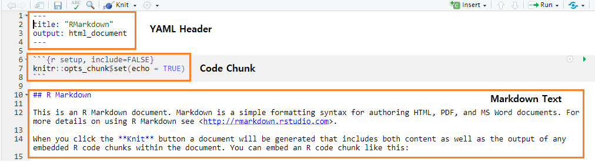
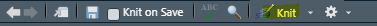
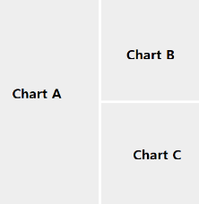
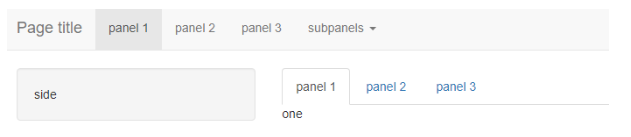

```{r setup, include=FALSE}
knitr::opts_chunk$set(echo = TRUE,
                      warning = FALSE,
                      message = FALSE,
                      out.width = "50%")
```

문서화는 모든 과정의 마무리 단계입니다. 데이터분석을 완료했다면 문서로 남길 필요가 있습니다. R에서는 크게 Rmarkdown을 이용한 문서화(html, pdf)와 shiny를 통한 앱 개발 두가지 종류가 있습니다.

# Rmarkdown을 이용한 문서화

Rmarkdown은 문서 내에서 코드(R, 파이썬 등)와 텍스트를 동시에 사용가능하게 해줍니다. - R Markdown = knit**r** + Pandoc **Markdown**

먼저 markdown이 뭔지 알아보도록 합시다. 일반적인 웹페이지는 마크업 언어(html: HyperText Markup Language)로 구성되어 있으며, 이를 꾸미기 위해서는 각종 태그를 이용하여 작성해야 하는 번거로움이 있습니다. 반면 마크다운은 간단한 특수기호와 문자를 이용하여 구조적인 웹문서를 빠르게 작성할 수 있습니다. Rmarkdown은 이러한 markdown의 기능을 계승하며, 이 외에도 latex, html(css)도 직접 사용이 가능합니다.

Rmarkdown의 문서화 과정은 다음과 같습니다. 먼저 Rmd로 문서를 작성하면 knitr 패키지가 R 코드를 실행 한 후 md 파일로 변환합니다. 그 후 pandoc 패키지가 각종 결과물로 변환(HTML, PDF, Work, Presentation 등) 합니다.


먼저 Rmd 파일은 [File → New File → R Markdown] 클릭하여 파일 생성이 가능합니다.



Rmarkdown은 크게 3가지 부분으로 구성됩니다.

-   YAML Header: 메타 데이터 부분. 문서의 전반적인 스타일 정의
-   code chunk: 코드 입력 부분
-   markdown: 텍스트 부분

상단의 [Knit] 버튼을 클릭하면 파일이 저장된 후 output으로 세팅한 형식의 문서가 출력됩니다. (기본값은 html)




## YAML Header

YAML(YAML Ain't Markup Language, 야믈)은 제목, 출력물 형태, css 스타일 등을 정의하는 부분입니다. 최상단에 위치하며 Rmarkdown에서는 위아래 --- 를 통해 정의됩니다. 각각의 정의는 콜론(:)을 통해 구분하며, 하부 내용은 엔터 후 띄어쓰기 2칸을 입력합니다.

    ---
    title: "R Markdown"
    author: "이현열"
    date: "`r format(Sys.Date())`" 
    output:
      html_document: 
        toc: yes
        toc_float: yes
        toc_depth: 2
        number_sections: yes
    ---


-   title: 제목
-   author: 저자
-   date: 날짜
-   output: 출력 형태
-   toc: table of content. 목차 생성 여부
-   toc_float: 목차가 유동적으로 움직일지 여부
-   toc_depth: 목차의 depth
-   number_section: 제목에 숫자를 부여할지 여부

또한 [Option 마크 → Output Options]를 통해서도 쉽게 YAML을 수정할 수 있습니다.


HTML 외에도 YAML을 변경하여 다양한 형태의 문서를 만들 수 있습니다.

-   <https://rmarkdown.rstudio.com/formats.html>

## Code Chunk

Rmarkdown의 가장 강력한 기능은 코드의 결과물을 문서 내에 녹여낼 수 있다는 점입니다. 코드 청크는 이러한 코드를 입력하는 부분이며, `{r}과` 가운데 코드를 입력하면 해당 코드가 실행된다. R 대신 Python이나 기타 언어도 설정이 가능합니다. 단축키는 ctrl + alt + I (mac: Cmd + Option+ i) 입니다.

```{r echo = FALSE, comment=''}
cat(htmltools::includeText('rmd/chunk.Rmd'))
```

코드 청크 우측 상단의 초록색 삼각형(▶)을 클릭하면 해당 부분의 코드가 실행됩니다. 위 코드를 실행하면 다음과 같이 출력됩니다.

```{r echo = FALSE}
plot(pressure)
```

이중 r 다음의 pressure는 해당 코드청크의 라벨이며 생략이 가능합니다. echo=FALSE는 옵션 부분에 해당하며, 이러한 옵션을 통해 코드와 결과물에 대한 다양한 셋팅을 할 수 있습니다. 대표적으로 사용되는 것은 다음과 같습니다.

-   eval: 코드를 실행할 지 여부
-   include: 코드 및 결과물을 문서에 포함할지 여부
-   echo: 문서에 코드를 보여줄 지 여부
-   error/message/warning: 오류/메세지/경고 여부를 문서에 출력할 지 여부
-   fig.align: 그림의 정렬(left, right, center)
-   fig.height, fig.width: 그림의 가로세로 길이

이 외에도 다양한 옵션에 대한 사항은 아래 사이트에서 확인할 수 있습니다.

-   <https://yihui.org/knitr/options/>

## Markdown Text

마크다운 문법을 이용해 텍스트를 입력하는 곳이며, Latex를 이용해 수식도 입력이 가능합니다다. 마크다운의 일반적인 사용법은 아래 페이지에서 확인할 수 있습니다.

<https://www.markdownguide.org/basic-syntax/>

상단의 [Visual]을 클릭하면 텍스트가 어떤 형태로 출력되는지 미리 확인할 수 있을 뿐만 아니라, 손쉽게 편집도 가능합니다.

### 수식 입출력

수식의 경우 인라인에 삽입할 경우 \$수식\$, 새로운 줄에 삽입할 경우 \$$수식$을 입력합니다.

    회귀식은 일반적으로 $y=ax+b$이며 다중회귀식은 다음과 같다.

    $$ y = a1x1 + a2x2 + \dots + b$$

회귀식은 일반적으로 $y=ax+b$이며 다중회귀식은 다음과 같다.

$$ y = a1x1 + a2x2 + \dots + b$$

수식안에 ⋯ 와 같은 LaTeX도 입력이 가능하며, 자주 사용되는 심볼은 아래에서 확인할 수 있습니다.

<https://www.math.uci.edu/~xiangwen/pdf/LaTeX-Math-Symbols.pdf>

수식이 길어질 경우 LaTeX를 이용하면 깔끔하게 표현할 수 있습니다. (&=은 정렬을 할 위치를 나타내며, \\는 줄바꿈을 의미합니다.)

    \begin{equation} 
    \begin{split}
    \hat \beta_{OLS} & = (X'X)^{-1}X'Y \\
    &= (X'X)^{-1}X'(X\beta+\epsilon) \\
    &= (X'X)^{-1}X'X\beta + (X'X)^{-1}X'\epsilon \\
    &= \beta + (X'X)^{-1}X'\epsilon 
    \end{split}
    \end{equation}

```{=tex}
\begin{equation} 
\begin{split}
\hat \beta_{OLS} &= (X'X)^{-1}X'Y \\
&= (X'X)^{-1}X'(X\beta+\epsilon) \\
&= (X'X)^{-1}X'X\beta + (X'X)^{-1}X'\epsilon \\
&= \beta + (X'X)^{-1}X'\epsilon 
\end{split}
\end{equation}
```
복잡한 LaTex는 아래 사이트에서 예제를 확인할 수 있습니다.

<http://www.hostmath.com/>

### HTML,CSS 적용

Rmarkdown에서는 문서에 HTML과 CSS를 적용할 수 있습니다. 이는 markdown으로 표현에 한계가 있는 부분을 보완할 수 있습니다.

    <div style="background-color:#F7F7F7;padding: 5px">
    이 부분의 배경은 회색으로 표현됩니다.
    </div>

혹은

    ::: {style="background-color:#F7F7F7;padding: 5px"}
    이 부분의 배경은 회색으로 표현됩니다.
    :::

#### 테이블 출력

마크다운 문법으로 표를 만드는 것은 다소 번거롭지만, [Visual]에서 클릭을 통해 쉽게 입력할 수 있습니다.

 

그러나 마크다운을 통해 만들어진 표의 단점은 이쁘지 않으며 다양한 편집을 할 수 없습니다. 이를 보완하기 위해 일반적으로 knitr 패키지의 `kable()` 함수를 이용해 테이블을 만든 후, kableExtra 패키지의 `kable_styling()` 함수나 formattable 패키지의 함수들을 이용하여 깔끔한 html 형태로 출력합니다.

```{r}
library(knitr)
library(kableExtra)

mtcars[1:5, ] %>%
  kable() %>%
  kable_styling(bootstrap_options = c("striped", "hover", "condensed", "responsive"))
```

kableExtra에 대한 더욱 자세한 설명은 아래에 나와있습니다.

이 외에도 HTML의 경우 일반적으로 DT 패키지를 이용해 datatable 형태의 인터랙티브 테이블로 출력합니다.

```{r}
library(DT)

mtcars %>%
  datatable(escape = FALSE,
            rownames= FALSE,
            extensions = 'Buttons',
            options = list(pageLength = 10,
                           dom = 'Bfrtip',
                           buttons = c('copy', 'csv', 'excel', 'pdf')
                           ))
  
```

테이블 내에 css를 직접 넣어 더욱 다채롭게 꾸밀수도 있습니다. R에서 datatable에 대한 자세한 사용법과 원래의 datatable에 대한 설명은 아래 페이지를 참조하기 바랍니다.

<https://rstudio.github.io/DT/> <https://datatables.net/>

### 그래프 출력

그래프는 일반적으로 `ggplot()` 함수를 사용해 출력합니다.

```{r}
library(ggplot2)
library(magrittr)

diamonds %>%
  ggplot(aes(x = carat, y = price)) +
  geom_point()
```

그러나 Rmarkdown을 통해 html 형태의 결과물을 출력할 경우 가장 강력한 접은 인터랙티브 기능이 가능하다는 점입니다. 따라서 plotly 등의 패키지를 이용해 인터랙티브 그래프로 표현할 경우 그래프를 더욱 풍부하게 표현할 수 있습니다.

`plotly()` 함수를 사용해 그래프를 표현하는 방법도 있으나, ggplot을 통해 그림을 그린 후 `ggplotly()` 함수를 사용하면 손쉽게 plotly 형태로 표현할 수 있습니다.

```{r}
library(ggplot2)
library(magrittr)
library(plotly)

(diamonds %>%
  ggplot(aes(x = carat, y = price)) +
  geom_point()
  ) %>%
  ggplotly()
```

R에서 plotly 차트를 사용하는 법은 아래의 책을 참조하기 바랍니다.

<https://plotly-r.com/>

### 이미지 삽입

먼저 HTML 태그를 이용해 이미지를 삽입할 수 있습니다.

    

또한 [Visual] 모드를 통해 손쉽게 넣을 수도 있다. 그림 삽입 버튼을 클릭한 후 원하는 그림을 선택합니다. 혹은 원하는 그림을 복사한 후 ctrl + v를 누르면 자동으로 images 폴더 내에 해당 이미지가 저장되면서 Rmarkdown 내에 그림이 삽입됩니다.

  \### 디자인

rmdformats 혹은 bslib 패키지 등을 설치할 경우 더욱 다양한 형태의 디자인을 사용할 수 있습니다. 특히 bslib 패키지의 경우 R Shiny에도 최신 bs 테마를 적용할 수 있습니다.

<https://www.datadreaming.org/post/r-markdown-theme-gallery/> <https://github.com/juba/rmdformats> <https://rstudio.github.io/bslib/index.html>

# Rmarkdown을 이용한 flexdashboard

대시보드란 다양한 데이터를 동시에 비교할 수 있게 해 주는 여러 뷰의 모음입니다. 예를 들어 매일 검토해야하는 데이터가 있다면 개별적으로 확인하기 보다는 대시보드를 만들어 효율적으로 파악할 수 있습니다.


일반 회사에서는 엑셀의 차트를 통해 대시보드를 만드는 경우가 가장 많으며, 전문적인 분석이 필요한 경우 Power BI, Tableau, Google Analytics와 같은 유료 프로그램을 사용하기도 합니다.

그러나 R을 이용할 경우 유료 프로그램에 버금가는 대시보드를 매우 손쉽게 만들 수 있습니다. 앱을 만드는데 최적화된 패키지인 Shiny를 이용할 수 있으며, 여기서 파생된 shinydashboard나 flexdashboard를 이용할 수도 있습니다. 그 중 Rmarkdown을 이용해 간단하게 대시보드를 만들 수 있는 flexdashboard 패키지에 대해 먼저 알아보도록 하겠습니다.

flexdashboard를 만드는 법은 매우 간단합니다. 먼저 [File → New File → Rmarkdown]을 선택한 후 [From Template]에서 [Flex Dashboard]를 선택합니다. (flexdashboard 패키지가 설치되어 있어야 합니다.)


아래 그림과 같이 Rmarkdown 파일이 생성됩니다.


먼저 Knit를 클릭해 어떠한 대시보드가 생성되는지 확인해봅시다.


상단에는 제목이, 본문에는 3개의 화면 패널이 생성됩니다. 이처럼 Rmarkdown을 통해 대시보드를 만드는데 필요한 레이아웃을 매우 쉽게 만들 수 있습니다. 이제 화면이 어떻게 구성되는지 구성요소를 하나씩 확인해보도록 합시다.

## YAML

기본적인 사항은 Rmarkdown과 비슷합니다.

    ---
    title: "Untitled"
    output: 
      flexdashboard::flex_dashboard:
        orientation: columns
        vertical_layout: fill
    ---

-   title: 화면 상단의 제목에 해당하는 부분입니다.
-   orientation: 화면분할 기준을 행으로 할 것인지, 열로 할 것인지를 선택한다. 행으로 하고자 할 경우 columns 대신 rows를 입력하면 됩니다.
-   vertical_layout: flexdashboard는 기본적으로 차트나 표의 크기를 조정해 한 화면 내에 모든 대시보드가 보이도록 합니다. 만약 대시보드가 길어져 스크롤이 필요할 경우 fill이 아닌 scroll을 입력하면 스크롤 기능이 생성됩니다.

## 레이아웃

먼저 샘플 코드를 살펴봅시다.

```{r echo = FALSE, comment=''}
cat(htmltools::includeText('rmd/flex.Rmd'))
```



Column 을 통해 레이아웃에서 새로운 컬럼을 생성합니다. 예제에서는 컬럼 후 `—--` 로 레이아웃을 정의했지만 h2(\##)를 통해서도 정의가 가능합니다. flexdashboard에서는 본문의 크기를 가로 세로 1000으로 가정하며, {data-width=650}를 통해 넓이가 650인 레이아웃이 생성됩니다. h3(\###) 후 이름을 입력하면 해당 이름의 차트가 생성됩니다(Chart A).

그 후 새로운 Column 을 통해 넓이가 350인 레이아웃이 생성되며, 새롭게 열 혹은 행을 나눠주기 전까지는 해당 레이아웃 내에서 차트를 나눕니다. 두번째 열에서는 Chart B와 Chart C가 분할된 것을 확인할 수 있습니다.

## 탭셋(Tabeset) 만들기

대시보드에 더욱 많은 내용을 넣고자 할때 탭셋을 이용하면 매우 효율적으로 표현할 수 있습니다. 레이아웃 부분에 탭셋 정의를 추가해줍니다.

```{r echo = FALSE, comment=''}
cat(htmltools::includeText('rmd/flex_tabset.Rmd'))
```


Chart B와 Chart C가 탭셋으로 분리되어 공간을 더욱 넓게 사용할 수 있습니다.

## 사이드바

각종 텍스트 혹은 입력값을 넣을 위젯은 좌측의 사이드바에 넣는 것이 일반적입니다. {.sidebar}로 정의해주면 사이드바가 생성됩니다.

```{r echo = FALSE, comment=''}
cat(htmltools::includeText('rmd/flex_side.Rmd'))
```


## 페이지 만들기

여러 페이지를 만들고자 할 경우 h1(\#)을 이용하면 됩니다.

```{r echo = FALSE, comment=''}
cat(htmltools::includeText('rmd/flex_2.Rmd'))
```


상단 메뉴에 [Page 1]과 [Page 2] 탭이 생성되어 각각의 페이지가 만들어집니다.

## 대시보드 작성하기

원하는 결과물에 맞춰 레이아웃을 구성했다면, 이제 각각의 차트에 표현하고자 하는 내용을 입력해야 합니다. 일반적으로 위젯, 게이지, 표, 그림이 사용됩니다다. 아래는 실제로 사용되는 flexdashboard를 이용한 대시보드입니다.


<https://blog.codecentric.de/explore-predictive-maintenance-flexdashboard>

위에서 배운 내용을 이용하면 이러한 대시보드를 매우 쉽게 만들 수 있습니다. 예제로써 팔머 펭귄(palmerpenguins) 데이터를 이용해 비슷한 대시보드를 만들어 보도록 하겠습니다.

```{r echo = FALSE, comment=''}
cat(htmltools::includeText('penguin.Rmd'))
```


예제와 비슷한 대시보드가 완성되었습니다. 한 부분씩 코드를 살펴보도록 하겠습니다.

### YAML 및 패키지 불러오기

flexdashboard를 위한 YAML 정의 및 대시보드에서 사용되는 패키지들을 불러옵니다.

### 탭 및 사이드바 부분

먼저 h1(\#)을 통해 상단에 Dashboard라는 탭을 만들었으며, data-icon을 통해 아이콘을 사용했습니다. 아래 홈페이지를 통해 flexdashboard에서 사용할 수 있는 각종 아이콘을 조회할 수 있습니다.

<https://ionic.io/ionicons/v2/cheatsheet.html>

또한 h2(\##)에서 .sidebar를 통해 사이드바를 선언했습니다. 사이드 내용에는 먼저 \<h3\>태그를 통해 제목을 입력했으며, 원하는 텍스트를 입력합니다. \<hr\>는 수평선을 그려주는 태그이며, 코드 청크 내에 `span()` 함수를 통해 펭귄 이미지를 입력했습니다. 일반적으로 대시보드나 앱에 사용되는 이미지 파일이나 css 파일은 www 폴더 내에 넣는게 일반적이다. 해당 이미지는 다음 주소에서 다운로드 받을 수 있습니다.

<https://github.com/hyunyulhenry/dmmr_quant/blob/main/www/penguins.png>

### 첫 번째 레이아웃

h2(\##)를 통해 넓이가 330인 레이아웃을 만들며, 레이아웃 이름은 [펭귄 데이터]로 입력합니다. markdown 문법을 통해 데이터에 대한 설명을 적으며, \<hr\> 태그를 통해 수평선을 그려줍니다. 그 후 펭귄 데이터를 datatable 형태로 나타냅니다.

### 두 번째 레이아웃

h2(\##)를 통해 넓이가 270인 레이아웃을 만들며, 펭귄별 차이 중 '부리길이' 와 '날개 및 무게' 두 구간으로 나눕니다. ggplot을 통해 원하는 형태의 그림을 그릴 수 있으며, `ggplotly()` 함수를 통해 plotly 형태로도 나타낼 수 있습니다.

### 세 번째 레이아웃

맨 우측에 넓이가 150인 레이아웃을 만들며, 이 부분에는 게이지 및 밸류박스를 입력합니다. 먼저 `gauge()` 함수를 통해 0\~100 사이의 값을 게이지 형태로 나타낼 수 있으며, `valueBox()` 함수를 통해 숫자들을 박스 형태로 나타낼 수 있습니다. 밸류박스에는 아이콘을 입력할 수도 있으며, color를 통해 색깔 역시 지정할 수 있습니다.

이처럼 Rmarkdown 문법을 이용해 매우 손쉽게 복잡한 형태의 대시보드를 만들 수 있습니다. 추가적으로 원하는 항목을 선택하면 해당 내역에 맞게 그림이나 표가 바뀌는 반응형 디자인 역시 R의 샤이니 프레임워크를 통해 가능합니다.

flexdashboard에 대한 자세한 설명은 다음 링크에서 확인할 수 있습니다.

<https://pkgs.rstudio.com/flexdashboard/articles/using.html>

# R을 이용한 Shiny App 만들기

웹페이지를 만들 때 어느정도 일관된 표준이 있어야 작업이 편리합니다. 그렇지 않으면 디자인도 제각각이고, 관리도 어려워집니다. 이러한 문제를 해결하기 위해 트위터의 개발자와 ui 디자이너가 시작한 프로젝트가 'Twitter Blueprint' 였으며, 이것이 발전하여 부트스트랩이 되었습니다. 한마디로 부트스트랩은 각종 레이아웃, 버튼, 입력창 등의 디자인을 CSS와 Javascript로 만들어 놓은 것입니다. 부트스트랩의 장점은 다음과 같습니다.

-   Easy to use: HTML과 CSS 기본지식을 가진 누구나 쉽게 접근 가능(+ javascript)
-   Responsive features: 반응형 CSS를 포함한 단일코드로 모든 디바이스에 적용할 수 있음
-   Mobile-first approach: 부트스트랩3부터 모바일 겸용이 아닌 모바일 퍼스트 정책 반영
-   Browser compatibility: 모든 최신 브라우저와 호환(크롬, 파이어폭스, 인터넷 익스플로러, 사파리, 오페라)

쉽게 말하면 오픈소스 즉 무료로 웹페이지를 만든 후 상업적으로 이용도 가능하고, 페이지 제작에 필요한 프레임부터 각종 디자인 까지 알아서 적용해주며, 웹버젼과 앱버젼을 따로 만들지 않아도 알아서 적용해줍니다.

샤이니는 R 코드를 이용해 부트스트랩 기반의 웹 어플리케이션을 만들 수 있는 프레임워크 입니다. 기존에 웹 앱을 만들기 위해서는 HTML, CSS, JavaScript 및 웹에 관련된 지식이 필요하지만, 샤이니를 이용할 경우 간단한 코드 만으로 웹앱을 만들 수 있습니다.

샤이니의 가장 큰 장점은 R 코드를 그대로 이용한다는 점입니다. 즉, R 내에서 백엔드 작업을 모두 한 후 바로 프론트엔드, 즉 웹앱으로 구현할 수 있기 때문에 데이터 수집과 분석, 모델링, 결과물 도출이 모두 R 생태계 내에서 구현이 가능합니다. 이러한 이유로 샤이니를 실무에서 쓰는 경우는 너무나 많으며, 회사 데이터를 이용해 샤이니 앱만을 제작해주는 업체도 존재합니다.

샤이니 앱을 만드는 법은 다음과 같습니다. R에서 [File → New File → Shiny Web App]을 선택합니다. Application name에 앱 이름을 만들고, type은 single file을 선택하며, 하단에 폴더가 만들어질 위치를 지정합니다.


다음과 같은 샘플 파일이 생성됩니다.


상단의 [▶ Run App] 옆의 ▼를 클릭하면 앱을 어디서 띄울지 선택할 수 있습니다.

-   Run in Window: R Studio 브라우저
-   Run in Viewer Pane: 우측 하단 패널
-   Run External: Chrome과 같은 외부 브라우저

본인이 원하는 세팅(Run External)을 선택한 후 [▶ Run App]을 클릭해 샤이니를 구동해봅시다.


이 중 좌측의 [Number of bins]을 움직이면 이에 맞게 히스토그램이 변합니다. 이처럼 웹페이지 내에서 고객이 선택하는 바에 따라 내용이 즉각적으로 변하는 것을 '인터렉티브 웹' 이라 합니다.

먼저 아래의 간단한 코드를 통해 샤이니의 구조를 살펴보도록 합시다.

```{r eval = FALSE}
library(shiny)

ui = fluidPage(
  "Hello, world!"
)

server = function(input, output, session) {

}

shinyApp(ui, server)
```

샤이니는 크게 ui, server 부분으로 구성되어 있습니다.

-   ui: User Interface, 즉 사용자가 보는 화면에 해당하는 부분으로써 프론트엔드 영역에 해당합니다.
-   server: ui에서 받은 값들을 계산하는 부분으로써 백엔드 영역에 해당합니다.

## 반응형(reactive) 앱에 대한 이해

샤이니의 가장 큰 장점은 반응형 앱을 구현할 수 있다는 것입니다. 즉 ui 부분에서 사용자가 입력한 값을 바탕으로 server에서 계산한 결과물을 다시 ui 부분에 출력할 수 있다는 점입니다. 이를 그림으로 나타내면 다음과 같습니다.


1.  ui 부분에 input 값을 입력합니다.
2.  server에 해당 input 값을 전송합니다.
3.  입력된 값을 토대로 output을 계산합니다.
4.  ui에 output을 전송해 표현합니다.

위 과정을 앱으로 구현하면 다음과 같습니다.

```{r eval = FALSE}
library(shiny)

ui = fluidPage(
  
 # 1
  sliderInput(inputId = 'num',
              label = "Number of Data",
              min = 300,
              max = 100000,
              value = 300),
  
 # 4
  textOutput('simNumber'),
  plotOutput('distPlot')
  
)

server = function(input, output, session) {
  
  # 2
  output$simNumber = renderText({
    paste0('Number of Generation: ', input$num)
  })
  
  # 3
  output$distPlot = renderPlot({
    x = rnorm(input$num, mean = 0, sd = 1) 
    hist(x,
         breaks = input$num / 100,
         main = 'Histogram of Random Generation Number')
  })
  
}

shinyApp(ui, server)
```

※ ui 부분은 코드 마다 [,]를 붙이지만, server 부분은 그렇지 않습니다.

위 코드를 실행하면 다음과 같습니다.


이제 코드를 하나씩 뜯어보며 살펴봅시다.

1.  먼저 ui의 `sliderInput()` 함수를 통해 입력값을 받습니다. 이처럼 인풋에 해당하는 부분은 `*Input()` 함수를 통해 만들 수 있습니다. inputId은 해당 인풋의 이름에 해당하는 부분이며, label은 웹앱에 나타나는 글자입니다. min, max, value는 최소, 최대 및 디폴트 값에 해당하는 인자입니다.

2.  입력된 인풋값을 서버에 전송하면 이를 토대로 계산을 합니다. 먼저 input\$num은 num이라는 input에 저장된 값입니다. `paste0()` 함수를 통해 [Number of Generation:] 이라는 글자와 합친 후, `renderText()` 함수를 통해 렌더링을 합니다. 이처럼 서버에서는 `render*()` 함수를 통해 원하는 아웃풋의 형태로 렌더링이 가능합니다. 그 후 해당 결과를 output의 simNumber에 저장한다. **렌더링이란 웹사이트 코드를 사용자가 웹 사이트를 방문할 때 보게 되는 대화형 페이지로 바꾸는 웹 개발에 사용되는 절차입니다.**

3.  distPlot도 마찬가지 입니다. 먼저 `rnorm()` 함수를 통해 평균이 0, 표준편차가 1인 정규분포에서 인풋값 만큼의 난수를 만듭니다. 그 후 `hist()` 함수를 통해 해당 값의 히스토그램을 그린 후, `renderPlot()` 함수를 통해 그림 형태로 렌더링을 합니다.

4.  다시 ui 부분에서는 `textOutput()` 함수와 `plotOutput()` 함수를 통해 렌더링된 글자 및 그림을 출력합니다. 이처럼 렌더링된 결과물을 ui부분에서 출력할 때는 `*Output()` 함수가 사용됩니다.

그러나 위의 예에서 input\$num이 3번 쓰였습니다. 즉 동일한 데이터 요청 작업을 3번 하는 것이며, 이는 앱의 성능을 저하시킵니다. 따라서 동일한 데이터가 여러번 쓰일 경우 요청은 1번만 하고 이를 사용하는 것이 훨씬 효율적입니다.

```{r eval = FALSE}
library(shiny)

ui = fluidPage(
  
  sliderInput(inputId = 'num',
              label = "Number of Data",
              min = 300,
              max = 100000,
              value = 300),
  
  textOutput('simNumber'),
  plotOutput('distPlot')
  
)

server = function(input, output, session) {
  
  num = reactive({
    input$num
  })
  
  output$simNumber = renderText({
    paste0('Number of Generation: ', num()) 
  })
  
  output$distPlot = renderPlot({
    x = rnorm(num(), mean = 0, sd = 1) 
    hist(x,
         breaks = num() / 100,
         main = 'Histogram of Random Generation Number')
  })
  
}

shinyApp(ui, server)

```

`reactive({})` 함수는 요청하여 받은 데이터를 캐시에 저장하는 역할을 합니다. 즉 `num = reactive({input$num})` 부분을 통해 input\$num 데이터를 num에 저장하고 이를 아래의 다른 코드들에 뿌려줍니다. 만일 ui 부분의 입력값인 input\$num이 바뀔 경우 `reactive()` 함수는 이에 반응하여 num 변수에 해당 값을 저장합니다.

## ui (user interface)

ui 부분은 프론트엔드, 즉 사용자가 보는 화면에 해당합니다. ui는 크게 서버로 넘길 input, 그리고 서버에서 계산된 결과를 출력하는 output 두가지 부분이 존재합니다.

### input

샤이니에서 인풋값을 입력할 때는 다양한 위젯이 사용됩니다. 원래 웹앱을 만드는 위젯을 구현하려면 복잡한 HTML과 CSS를 사용해야 하지만, 샤이니에서는 간단한 코딩으로 여러가지 위젯을 구현할 수 있습니다. shiny 패키지에서 기본으로 제공하는 위젯은 아래 사이트에서 확인할 수 있습니다.

<https://shiny.rstudio.com/gallery/widget-gallery.html>

예를 들어 체크박스 그룹에 해당하는 코드를 알고 싶으면, 해당 부분의 [See Code]를 클릭합니다.


그후 [ui.R]탭을 클릭하면 ui 부분에 해당 위젯을 만들기 위한 코드가 나타납니다.

```{r eval = FALSE}
checkboxGroupInput("checkGroup", label = h3("Checkbox group"), 
    choices = list("Choice 1" = 1, "Choice 2" = 2, "Choice 3" = 3),
    selected = 1)
```

-   checkGroup: id를 나타냅니다.
-   label: 화면에 출력되는 텍스트를 나타내며, h3은 텍스트의 크기를 조절하는 함수입니다.
-   choices: 선택값입니다. list 내부에 값을 입력할 경우 Choice 1, 2, 3는 화면에서 보이는 내용, 1,2,3은 각각 매칭되는 인풋값입니다. 즉, 화면에서 Choice 1을 선택하여도 server에는 1이라는 인풋값이 전송됩니다.
-   selected: 디폴트로 선택하는 인풋값입니다.

텍스트, 숫자, 날짜 등을 슬라이드, 체크박스 등 다양한 형태로 입력할 수 있는 위젯이 존재하므로, 본인의 앱에 맞는 것을 선택하면 됩니다. 또한 shinyWidgets 패키지를 이용할 경우 위젯을 꾸밀 수도 있으며 더욱 다양한 위젯이 존재하므로, 기본 위젯보다는 해당 패키지를 사용할 것을 추천드립니다.

<http://shinyapps.dreamrs.fr/shinyWidgets/>

체크박스 그룹에서 두 개의 결과물을 비교해보도록 합시다.

```{r eval = FALSE}
library(shiny)
library(shinyWidgets)

ui = fluidPage(
 checkboxGroupInput("checkGroup", label = "Default Widget", 
                     choices = list("Choice 1" = 1, "Choice 2" = 2, "Choice 3" = 3),
                     selected = 1),  

  awesomeCheckboxGroup(
    inputId = "checkGroupWidgets",
    label = "shinyWidgets", 
    choices = list("Choice 1" = 1, "Choice 2" = 2, "Choice 3" = 3),
    selected = 1
  )  
)

server <- function(input, output, session) {  
}

shinyApp(ui, server)
```


위에 있는 것이 기본 체크박스, 아래에 있는 것이 shinyWidgets 패키지를 사용한 체크박스 입니다. 패키지를 사용하는 것이 좀 더 깔끔하다는 것을 느낄 수 있습니다. 이 외에도 색깔을 변경하거나, 선택시 효과를 주는 등 다양한 옵션을 추가할 수도 있습니다.

### output

output은 서버에서 계산된 결과를 출력하는 부분이며, `*Output()` 함수를 통해 출력이 됩니다. 아웃풋의 경우 서버에서 렌더링 한 형태와 동일한 형태를 사용해야 결과물이 나타내며, 그렇지 않을 경우 아무런 정보도 출력되지 않습니다.

```{r eval = FALSE}
library(shiny)

ui = fluidPage(  
  plotOutput('table')  
)

server <- function(input, output, session) {  
  output$table = renderTable({
    mtcars
  })  
}

shinyApp(ui, server)

```

서버에서는 mtcars 데이터를 `renderTable()` 함수를 통해 테이블 형태로 렌더링 한 반면, ui에서는 `plotOutput()` 함수를 통해 plot 형태로 출력하였습니다.. 그 결과 앱을 실행하면 아무런 결과도 나타나지 않는다. 이번에는 제대로된 아웃풋 함수를 사용해보도록 하겠습니다.

```{r eval = FALSE}
library(shiny)

ui = fluidPage(  
  tableOutput('table')  
)

server <- function(input, output, session) {  
  output$table = renderTable({
    mtcars
  })  
}

shinyApp(ui, server)
```


`tableOutput()` 함수를 사용하면 테이블이 제대로 출력됩니다. 이처럼 서버의 `render*()` 함수와 ui의 `*Output()` 함수는 서로 쌍이 맞아야합니다.

Shiny의 아웃풋은 크게 텍스트, 테이블, 그림이 있습니다.

#### 텍스트

```{r eval = FALSE}
ui = fluidPage(
  textOutput('text1'),
  verbatimTextOutput('text2')
)

server = function(input, output, session) {
  output$text1 = renderText({ 
    "Hello World!"
  })

  output$text2 = renderPrint({ 
    "Hello World!"
  })
}

shinyApp(ui, server)
```


| 렌더링                 | 출력            |
|------------------------|-----------------|
| `textOutput()`         | `renderText()`  |
| `verbatimTextOutput()` | `renderPrint()` |

전자의 경우 단순히 문자가 출력되는 반면, 후자의 경우 회색의 블록이 생성되면서 문자가 출력되는 차이가 있습니다.

#### 테이블

```{r eval = FALSE}
library(shiny)
library(DT)
library(magrittr)

ui = fluidPage(
  tableOutput('static'),
  tableOutput('knitr'),
  dataTableOutput('dynamic')
)

server = function(input, output, session) {
  output$static = renderTable({
    head(mtcars)
    })
  
  output$knitr = function() {
    mtcars %>% head() %>%
      knitr::kable() %>%
      kableExtra::kable_styling(bootstrap_options =
                                  c("striped", "hover", "condensed", "responsive")) 
    }
  
  output$dynamic = renderDataTable({
    head(mtcars) %>% datatable()
    })
}

shinyApp(ui, server)

```


| 렌더링              | 출력                |
|---------------------|---------------------|
| `tableOutput()`     | `renderTable()`     |
| `tableOutput()`     | `function()`        |
| `dataTableOutput()` | `renderDataTable()` |

첫번째의 경우 가장 기본적인 마크다운 테이블이, 두번째의 경우 knitr 패키지를 이용해 꾸며진 테이블이, 마지막의 경우 DataTable 형태가 출력됩니다. 이 외에도 다양한 패키지를 이용한 테이블 구성 및 출력을 할 수도 있습니다.

#### 그림

```{r eval = FALSE}
library(shiny)
library(ggplot2)
library(magrittr)

ui = fluidPage(
  plotOutput('normal'),
  plotOutput('ggplot'),
  plotlyOutput('plotly')
)

server = function(input, output, session) {
  output$normal = renderPlot({
    plot(1:5)
  })
  
  output$ggplot = renderPlot({
   data.frame(x = 1:5, y = 1:5) %>%
      ggplot(aes(x = x, y = y)) +
      geom_point()
  })
  
   output$plotly = renderPlotly({
   (data.frame(x = 1:5, y = 1:5) %>%
      ggplot(aes(x = x, y = y)) +
      geom_point()) %>% ggplotly()
  })
}

shinyApp(ui, server)
```


| 렌더링           | 출력             |
|------------------|------------------|
| `renderPlot()`   | `plotOutput()`   |
| `renderPlotly()` | `plotlyOutput()` |

첫번째 경우는 R에서 기본적으로 제공하는 그림이 출력되는 반면 아래의 경우 ggplot2 패키지를 이용한 그림이 출력됩니다. 마지막에는 plotly를 이용한 동적 그래프가 출력됩니다.

## 레이아웃

페이지의 틀을 잡는 레이아웃 역시 코드를 통해 간단히 설정할 수 있습니다. 일반적으로 앱은 다음과 같은 레이아웃으로 구성됩니다.


이를 코드로 나타내면 다음과 같습니다.

```{r eval = FALSE}
library(shiny)

ui = fluidPage(
  
  titlePanel(
    "Title"
  ),
  
  sidebarLayout(
    
    sidebarPanel(
      sliderInput(inputId = 'num',
                  label = "Number of Data",
                  min = 300, max = 100000, value = 300)
    ),
    mainPanel(
      textOutput('simNumber')
    )
  )
)

server = function(input, output, session) {
  
  output$simNumber = renderText({
    paste0('Number of Generation: ', input$num)
  })
  
}

shinyApp(ui, server)
```

 사이드바가 필요없을 경우 `sidebarPanel()`를 생략하면 됩니다.

본문에 해당하는 mainPanel 역시 레이아웃을 지정할 수 있습니다. 참고로 R shiny에서는 본문의 넓이를 12로 정의합니다.


```{r eval = FALSE}
library(shiny)

ui = fluidPage(
  
  titlePanel(
    "Title"
  ),
  
  sidebarLayout(
    sidebarPanel(
      sliderInput(inputId = 'num',
                  label = "Number of Data",
                  min = 300, max = 100000, value = 300)
    ),
    mainPanel(
      fluidRow(
        column(6, style = "background-color:red;", print('red')),
        column(6, style = "background-color:blue;", print('blue')), 
        hr(),
        column(8, style = "background-color:green;", print('green')), 
        column(4, style = "background-color:yellow;", print('yellow'))         
      )
    )
  )
)

server = function(input, output, session) {
  
}

shinyApp(ui, server)
```


이 외에도 샤이니 앱은 하나의 탭이 아니라 여러개의 탭을 만드는 것도 가능합니다.​ 이 경우 최상단에 `fluidPage()`가 아닌 `navbarPage()`를 사용합니다.

```{r eval = FALSE}
library(shiny)

ui = navbarPage(
    "Page title",   
    tabPanel("panel 1",
             sidebarLayout(
               sidebarPanel(
                 print('side')
             ),
             mainPanel(
               tabsetPanel(
                 id = "tabset",
                 tabPanel("panel 1", "one"),
                 tabPanel("panel 2", "two"),
                 tabPanel("panel 3", "three")
               )
               )
             )
             ),
    tabPanel("panel 2", "two"),
    tabPanel("panel 3", "three"),
    navbarMenu("subpanels", 
               tabPanel("panel 4a", "four-a"),
               tabPanel("panel 4b", "four-b"),
               tabPanel("panel 4c", "four-c")
               )
    )


server = function(input, output, session) {
  
}

shinyApp(ui, server)

```

 페이지 레이아웃의 경우 완성하고자 하는 앱의 형태를 손으로 그려 놓고, 이에 맞게 만드는 것이 훨씬 효율적입니다다. 또한 레이아웃부터 잡아놓은 후 ui와 server 부분의 코드를 채워나가는 것이 개발을 할때 훨씬 편합니다. 레이아웃에 대해서는 아래 페이지에 자세히 설명되어 있습니다.

<https://shiny.rstudio.com/articles/layout-guide.html>

## mtcars 예제

mtcars 데이터를 통해 실제 앱을 어떻게 만드는지 순서를 따라가보도록 하겠습니다. 먼저 cyl(실린더 수)에 따른 mpg(연비)와 wt(중량)의 관계를 보고자 합니다. 만일 cyl == 6인 데이터만 선택하고자 할 경우 코드는 다음과 같습니다.

```{r}
mtcars %>%
  select(mpg, cyl, wt) %>%
  filter(cyl == 6)
```

만일 여러개를 기준으로 필터를 할 경우 코드는 다음과 같습니다.

```{r}
mtcars %>%
    select(mpg, cyl, wt) %>%
    filter(cyl %in% c(4,6))
```

이 중 `c(4,6)` 내부의 숫자가 바뀜에 따라 데이터가 바뀐다고 유추할 수 있으므로, 이를 사이드바에 위젯으로 넣으면 됩니다.

또한 이를 점도표로 나타내는 코드는 다음과 같습니다.

```{r}
mtcars %>%
  select(mpg, cyl, wt) %>%
  filter(cyl %in% c(4, 6)) %>%
  ggplot(aes(x = mpg, y = wt, color = factor(cyl))) +
  geom_point(size = 5)
```

위를 바탕으로 실런더를 선택하면 해당 테이블 및 그림을 표현하는 코드는 다음과 같습니다.

```{r}
library(shiny)
library(DT)
library(ggplot2)
library(dplyr)
library(magrittr)

ui = fluidPage(
  
  titlePanel("mtcars"),
  sidebarLayout(
    
    sidebarPanel(
      checkboxGroupInput("cyl", label = '실린더를 선택하세요',
                     choices = list(4, 6, 8),
                     selected = 4)
      ),
    
    mainPanel(
      dataTableOutput('mtcars_table'),
      plotOutput('mtcars_plot')
    )
    )
)

server = function(input, output, session) {
  
  sel_mtcars = reactive({
    mtcars %>%
      select(mpg, cyl, wt) %>%
      filter(cyl %in% input$cyl)
  })
  
  output$mtcars_table = renderDataTable({
    
    sel_mtcars() %>%
      datatable()
  })
  
  output$mtcars_plot = renderPlot({
    
    sel_mtcars() %>%
      ggplot(aes(x = mpg, y = wt, color = factor(cyl))) +
      geom_point(size = 5)

 })  
  
}
shinyApp(ui, server)
```


왼쪽의 위젯을 클릭함에 따라 이에 맞게 테이블과 그림이 바뀝니다.

※ 실무에서는 위젯의 입력값인 4, 6, 8도 손으로 입력하는 방식이 아닌 데이터가 바뀔 때 마다 이에 맞게 자동으로 바뀌는 방법을 사용합니다.

## 반응 격리(isolating) 하기

앞서 ui에서 입력된 값에 따라 반응형으로 변하는 앱을 만들었습니다. 그러나 데이터가 매우 클 경우 위젯값을 바꿀때마다 이에 반응한다면 시간도 오래 걸리며, 불필요한 작업이 계속 돌아가게 됩니다.

예를 들어 실린더가 4, 6, 8인 데이터를 분석하고자 합시다. 기본적으로 4가 선택된 상태에서 6을 선택하면 이에 맞게 계산이 되고 결과가 출력됩니다. 이러한 작업이 진행되는 와중 8을 선택하면 또 이에 맞게 계산이 되고 결과가 출력됩니다. 그러나 실무에서는 분석하고자 하는 항목이 작게는 몇개, 많게는 수십게 이므로 매번 선택을 변경할 때 마다 작업이 돌아갈 경우 상당한 리소스를 잡아먹습니다. 결과적으로 우리가 원하는 결과가 [4, 6, 8]을 선택한 것일 경우 값을 모두 선택한 후 [실행] 버튼을 누르면 그제서야 계산이 되는 것이 훨씬 효율적입니다. 이를 '반응 격리'라 합니다. 해당 작업에는 대표적으로 `eventReactive()` 함수가 사용됩니다. 이는 input값의 변경에 즉시 반응하는 것이 아닌 반응을 지연시키는 함수로써, 특정 동작이 발생했을 때 변경된 사항에 반응을 시킵니다.

```{r eval = FALSE}
library(shiny)
library(DT)
library(ggplot2)
library(dplyr)
library(magrittr)

ui = fluidPage(
  
  titlePanel("mtcars"),
  sidebarLayout(
    
    sidebarPanel(
      checkboxGroupInput("cyl", label = '실린더를 선택하세요',
                     choices = mtcars[['cyl']] %>% unique() %>% sort(),
                     selected = mtcars[['cyl']] %>% unique() %>% sort() %>% .[1]),
      
      actionButton('go', label = '분석을 실행하세요!')
      
      ),
    
    mainPanel(
      dataTableOutput('mtcars_table'),
      plotOutput('mtcars_plot')
    )
    )
)

server = function(input, output, session) {
  
  sel_mtcars = eventReactive(input$go, {
    mtcars %>%
      select(mpg, cyl, wt) %>%
      filter(cyl %in% input$cyl)
  })
  
  output$mtcars_table = renderDataTable({
    
    sel_mtcars() %>%
      datatable()
  })
  
  output$mtcars_plot = renderPlot({
    
    sel_mtcars() %>%
      ggplot(aes(x = mpg, y = wt, color = factor(cyl))) +
      geom_point(size = 5)
  })  
}

shinyApp(ui, server)
```


먼저 ui에서는 동작을 입력하기 위해 `actionButton()`을 통한 버튼을 만듭니다. server에서는 `eventReactive()` 함수 내에 input\$go가 실행되었을 때, 즉 액션버튼이 클릭되었을 때 수행될 동작을 입력합니다. 앱을 실행해보면 해당 버튼을 클릭해야만 동작이 실행되어 테이블과 그래프가 출력됩니다.

실무에서는 사이드바에 여러 입력값을 넣은 후 액션버튼을 클릭할 경우, 이에 맞게 sql에 쿼리를 날려 해당하는 데이터를 받아오도록 설계하기도 합니다.

## tidy evaluation

Shiny 내에서 tidyverse(ggplot2, dplyr) 패키지를 이용할 경우 원하는 대로 앱이 구현되지 않을수도 있습니다. 이는 R의 기본 문법과 tidyverse에서의 문법이 다르기 때문입니다. 아래의 예제를 살펴봅시다.

```{r eval = FALSE}
library(shiny)

num_vars =  c("carat", "depth", "table", "price", "x", "y", "z")

ui = fluidPage(
  selectInput("var", "Variable", choices = num_vars),
  numericInput("min", "Minimum", value = 1),
  tableOutput("output")
)

server = function(input, output, session) {
  data = reactive(diamonds %>% filter(input$var > input$min))
  output$output = renderTable(head(data()))
}

shinyApp(ui, server)
```


input\$var에는 열 이름이, input\$min에는 값이 들어가게 됩니다. 즉, `reactive()` 내에서는 `filter()` 함수를 통해 해당 열의 값이 특정 값보다 크다는 조건을 만족하는 데이터만 선택하도록 하였습니다. 그러나 결과를 살펴보면 carat이 1보다 작은 데이터도 모두 선택되었습니다.

dplyr 문법에서 carat이 1보다 큰 데이터를 선택하는 코드는 다음과 같습니다.

```{r}
diamonds %>% filter(carat >= 1)
```

그러나 shiny의 input을 통해 변수를 받을 경우 input$var는 'caret'이 됩니다. 따라서 다음과 같이 코드가 실행되어 제대로된 결과가 나타나지 않습니다.

```{r}
diamonds %>% filter('carat' >= 1)
```


tidyverse에서는 열 이름에 해당하는 부분에 따옴표('')를 입력하지 않아도 되지만, input으로 값을 받아올 경우 문자열로 인식되어 따옴표가 붙어 발생하는 문제입니다. 먼저 dplyr에서 우리가 원한느 데이터를 선택하는 법은 다음과 같습니다.

```{r}
min = 1
diamonds %>% filter(carat > min)
```

이를 R의 기본문법으로 나타내면 다음과 같습니다.

```{r}
min = 1
diamonds[diamonds$carat > min, ]
```

기본 문법에서도 '$열이름' 형태로 입력하면 따옴표를 붙이지 않아도 인식이 됩니다. 

```{r}
var = "carat"
diamonds[diamonds[[var]] > min, ]
```

만일 따옴표가 붙을 경우, `$` 대신 `[[`를 사용하면 동일한 결과를 얻을 수 있습니다. 이를 dplyr 문법에 적용해보도록 합시다.

```{r}
min = 1
diamonds %>% filter(.data$carat > .env$min)
```

'.data'는 데이터프레임에서 data-variables 부분을, .env는 환경(environment)에서 env-variables 부분을 의미합니다. (https://search.r-project.org/CRAN/refmans/rlang/html/dot-data.html)

만일 열 이름을 문자열로 입력할 경우 dplyr에서 다음과 같이 입력하면 됩니다.

```{r}
var = 'carat'
diamonds %>% filter(.data[[var]] > .env$min)
```

Shiny의 input을 통해 받은 입력값을 var와 min 부분에 대입하면 우리가 원하는 필터 기능이 수행됩니다.

```{r eval = FALSE}
num_vars <- c("carat", "depth", "table", "price", "x", "y", "z")

ui <- fluidPage(
  selectInput("var", "Variable", choices = num_vars),
  numericInput("min", "Minimum", value = 1),
  tableOutput("output")
)

server <- function(input, output, session) {
  data <- reactive(diamonds %>% filter(.data[[input$var]] > .env$input$min))
  output$output <- renderTable(head(data()))
}

shinyApp(ui, server)
```

이처럼 Shiny widget을 통해 받은 input 값을 dplyr 문법에 적용할 때는 .data와 .env를 이용해야 제대로 된 결과를 출력할 수 있습니다. 이는 ggplot을 통한 시각화에도 그대로 적용됩니다. iris 데이터를 시각화하는 법은 다음과 같습니다.

```{r}
library(ggplot2)

iris %>%
  ggplot(aes(x = Sepal.Length, y = Sepal.Width)) +
  geom_point()
```

`aes()` 내의 x와 y부분에 열이름을 입력하며, 따옴표를 붙이지 않은 상태로 입력해야 합니다. 이를 shiny에 적용하면 다음과 같습니다.

```{r eval = FALSE}
ui = fluidPage(
  selectInput("x", "X variable", choices = names(iris)),
  selectInput("y", "Y variable", choices = names(iris)),
  plotOutput("plot")
)

server = function(input, output, session) {
  output$plot = renderPlot({
    ggplot(iris, aes(input$x, input$y)) +
      geom_point()
    })
}

shinyApp(ui, server)
```


코드대로라면 위젯에서 선택하는 열에 맞춰 x축과 y축이 변경되어야 하지만 제대로 작동하지 않습니다. 이는 위젯에서 선택된 값이 문자열로 인식되어, `aes()` 내에도 문자열로 입력되기 때문입니다. 이 역시 위의 dplyr 케이스와 마찬가지로 .data와 .env를 이용하면 우리가 원하는 앱을 구현할 수 있습니다.

```{r eval = FALSE}
ui = fluidPage(
  selectInput("x", "X variable", choices = names(iris)),
  selectInput("y", "Y variable", choices = names(iris)),
  plotOutput("plot")
)

server = function(input, output, session) {
  output$plot = renderPlot({
    ggplot(iris, aes(.data[[input$x]], .data[[input$y]])) +
      geom_point()
    })
}

shinyApp(ui, server)
```

혹은 `aes()` 대신 `aes_string()` 함수를 이용할 경우 문자 형태를 그대로 입력해도 됩니다.

```{r}
ui = fluidPage(
  selectInput("x", "X variable", choices = names(iris)),
  selectInput("y", "Y variable", choices = names(iris)),
  plotOutput("plot")
)

server = function(input, output, session) {
  output$plot = renderPlot({
    ggplot(iris, aes_string(input$x, input$y)) +
      geom_point()
    })
}

shinyApp(ui, server)
```

## 기타

### 테마

샤이니는 부트스트랩을 기반으로 만들어 졌습니다. 따라서 부트스트랩에 적용되는 테마를 그대로 사용할 수 있습니다. 각종 BS 테마는 아래 사이트에서 확인할 수 있습니다. 

<https://bootswatch.com/>

샤이니 테마를 꾸미기 위해 가장 대표적으로 사용되는 패키지는 shinythemes 입니다.

<https://rstudio.github.io/shinythemes/>

```{r eval = FALSE}
library(shiny)
library(shinythemes)

ui = fluidPage(
    theme = shinytheme("superhero"),
    # shinythemes::themeSelector(),
    sidebarPanel(
      textInput("txt", "Text input:", "text here"),
      sliderInput("slider", "Slider input:", 1, 100, 30),
      actionButton("action", "Button"),
      actionButton("action2", "Button2", class = "btn-primary")
    ),
    mainPanel(
      tabsetPanel(
        tabPanel("Tab 1"),
        tabPanel("Tab 2")
      )
    )
  )

server = function(input, output, session) {

}

shinyApp(ui, server)
```


가장 상단에 `theme = shinytheme("superhero")` 를 추가하면 superhero 테마가 적용됩니다. 이 외에 다른 테마를 확인하고자 할 경우 `shinythemes::themeSelector()`를 입력하면 각 테마별로 페이지가 어떻게 변하는지 확인할 수 있습니다.

그러나 해당 패키지는 부트스트랩 버젼 3만을 지원합니다. 만일 버젼 4 혹은 그 이상에 해당하는 테마를 적용하고 싶을 경우 bslib 패키지를 사용하면 됩니다. (해당 패키지는 Rmarkdown의 테마에도 적용이 가능합니다.)

<https://rstudio.github.io/bslib/articles/bslib.html>

```{r eval = FALSE}
library(shiny)
library(bslib)

ui = fluidPage(
    theme = bs_theme(bootswatch = "minty"),
    sidebarPanel(
      textInput("txt", "Text input:", "text here"),
      sliderInput("slider", "Slider input:", 1, 100, 30),
      actionButton("action", "Button"),
      actionButton("action2", "Button2", class = "btn-primary")
    ),
    mainPanel(
      tabsetPanel(
        tabPanel("Tab 1"),
        tabPanel("Tab 2")
      )
    )
  )

server = function(input, output, session) {

}

shinyApp(ui, server)
```


혹은 직접 css를 입력해 테마를 만들어도 됩니다.

### 객체지향

기존의 R이 절차지향 프로그래밍이었다면, Shiny는 객체지향 프로그래밍에 가깝습니다. 즉, server 내에 들어가는 코드들은 그 순서가 바뀌어도 실행이 됩니다. 따라서 샤이니를 만들때는 각 모듈별로 함수를 만들거나 파일로 저장한 후, 이를 불러오는 방식을 사용하는 것이 코드도 간결하고 추후 디버깅이나 업데이트 하기도 편합니다.

<https://github.com/hyunyulhenry/GDAA>

### 참고 페이지

샤이니를 기반으로 제작된 패키지는 셀 수 없이 많습니다. <https://github.com/nanxstats/awesome-shiny-extensions>

샤이니를 더 전문적으로 공부하고 싶으면 해들리 위컴의 책을 매우 추천합니다. <https://mastering-shiny.org/>

R studio 사이트에도 개별 렉쳐가 매우 잘 되어있습니다. <https://shiny.rstudio.com/>

대시보드 형태로 만들고자 할 경우 shinydashboard 형태로 만들면 됩니다. shiny와 코드가 거의 똑같으므로, 샤이니를 제대로 금방 적용이 가능합니다. <https://rstudio.github.io/shinydashboard/>

샤이니의 배포는 내부서버, <https://www.shinyapps.io/> 혹은 AWS를 이용하면 됩니다.
