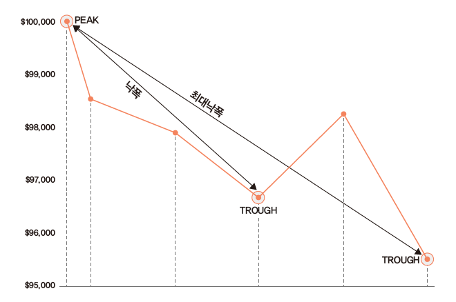

```{r setup, include=FALSE}
knitr::opts_chunk$set(echo = TRUE,
                      warning = FALSE,
                      message = FALSE,
                      out.width = "50%")
```

포트폴리오 혹은 전략의 수익률을 바탕으로 각종 성과 및 위험을 평가해야 합니다. 아무리 성과가 좋은 전략이라도 위험이 너무 크다면 투자를 하기 부담스럽습니다. 또한 전략의 수익률이 지속적으로 감소하는 추세라면 경쟁이 치열해져 더 이상 작동하지 않는 전략일 가능성도 있습니다.

포트폴리오의 예시로 버크셔 헤서웨이(Berkshire Hathaway Inc.) 주식의 수익률을 이용하겠습니다. 해당 주식의 수익률을 통해 성과 및 위험을 평가해보고, 회귀분석을 통해 팩터에 대한 노출도도 살펴보겠습니다.

```{r}
library(quantmod)

getSymbols('BRK-B', from = '1996-01-01')
price = Ad(`BRK-B`)
```

# 결과 측정 지표

포트폴리오의 평가에서 가장 중요한 지표는 수익률과 위험입니다. 수익률은 누적수익률과 연율화 수익률, 연도별 수익률이 주요 지표이며, 위험은 변동성과 낙폭이 주요 지표입니다.

이 외에도 승률, 롤링 윈도우 값 등 다양한 지표를 살펴보기도 합니다. 이러한 지표를 수식을 이용해 직접 계산할 수도 있지만, PerformanceAnalytics 패키지에서 제공하는 다양한 함수들을 이용해 편하게 계산할 수 있습니다.

## 수익률 및 변동성

```{r}
library(PerformanceAnalytics)
chart.TimeSeries(price)
```

`chart.TimeSeries()` 함수를 통해 수익률을 그릴 수 있습니다.

```{r}
library(ggplot2)
library(magrittr)

price %>% fortify.zoo() %>%
  set_colnames(c('date', 'value')) %>%
  ggplot(aes(x = date, y = value)) +
  geom_line()
```

좀 더 섬세한 그래프 작업을 해야할 때는 `ggplot()` 함수를 이용하면 됩니다.

```{r}
ret = Return.calculate(price)
chart.CumReturns(ret)
```

만일 수익률로 계산된 경우 `chart.CumReturns()` 함수를 이용해 누적수익률을 그릴수도 있습니다.

수익률 중 가장 많이보는 지표는 누적 수익률, 연율화 수익률(산술), 연율화 수익률(기하)입니다. 각 수익률을 구하는 법은 다음과 같습니다.

1. 누적 수익률: $(1+r_1) \times (1+r_2) \times \dots \ \times (1+r_n) - 1 = \{\prod_{i=1}^n(1+r_i)\}-1$,
2. 연율화 수익률(산술): $\frac{(r_1 + r_2 + \dots + r_i)}{n} \times scale$
3. 연율화 수익률(기하): $\{\prod_{i=1}^n(1+r_i)\}^{scale / Days} - 1$

먼저 누적수익률은 각 수익률에 1을 더한 값을 모두 곱한 후 1을 빼면 됩니다. 연율화 수익률(산술)은 단순히 수익률의 평균을 구한 후 연율화를 위한 조정값($scale$)을 곱해주면 됩니다. 데이터가 일간일 경우 조정값은 252, 주간일 경우 52, 월간일 경우 12입니다. 현재 데이터는 월간 기준이므로 조정값은 12가 됩니다. 마지막으로 연율화 수익률(기하)은 각 수익률에 1을 더한 값의 곱을 구한 후 연율화를 위해 승수를 적용한 후 1을 빼주며, Days는 시계열의 관측 기간입니다. 마지막으로 연율화 수익률(기하)의 경우 각 수익률에 1을 더한 값의 곱을 구한 후, 연율화를 위해 승수를 곱한 후 1을 빼주면 되며, $Days$는 시계열의 관측 기간입니다.

수식에 맞게 값을 입력해 계산할 수도 있지만, 함수를 이용하면 더욱 손쉽게 계산이 가능하며 실수할 가능성도 줄어듭니다. 

```{r}
Return.cumulative(ret)
```

누적수익률은 `Return.cumulative()` 함수를 통해 구할 수 있습니다.

```{r}
Return.annualized(ret, geometric = FALSE) # 연율화 수익률(산술)

Return.annualized(ret) # 연율화 수익률(기하)
```

연율화 수익률(산술)은 `Return.annualized()` 함수 내 geometric 인자를 FALSE로 선택해줌으로써, 연율화 수익률(기하)는 `Return.annualized()` 함수를 통해 계산이 가능합니다. 

위험으로 가장 많이 사용되는 지표는 변동성입니다. 연율화 변동성은 `sd()` 함수를 통해 변동성을 계산한 후 조정값을 곱해 계산할 수도 있지만, `StdDev.annualized()` 함수를 사용해 더욱 쉽게 계산할 수도 있습니다.

```{r}
StdDev.annualized(ret) # 연율화 변동성
```

수익을 위험으로 나누어 위험 조정 수익률을 보는 지표가 샤프 지수(Sharpe Ratio)입니다. 해당 지수는 $\frac {R_i - R_f}{\sigma_i}$로 계산되며, 분자에는 포트폴리오 수익률에서 무위험 수익률을 차감한 값이, 분모에는 포트폴리오의 변동성이 오게 됩니다.

```{r}
SharpeRatio.annualized(ret, Rf = 0, geometric = TRUE)
```

`SharpeRatio.annualized()` 함수를 이용하면 포트폴리오 수익률에서 무위험 수익률을 차감한 값을 연율화로 변경한 후 연율화 변동성으로 나누어 샤프 지수를 계산합니다. geometric을 TRUE로 설정하면 기하평균 기준 연율화 수익률을, FALSE로 설정하면 산술평균 기준 연율화 수익률을 계산합니다.

## 낙폭(drawdown)과 최대낙폭(MDD)

먼저 낙폭(Drawdown)은 수익률이 하락한 후 반등하기 전까지 얼마나 하락했는지를 나타냅니다. 최대낙폭(Maximum Drawdown)은 이러한 낙폭 중 가장 값이 큰 값으로서, 최고점에서 최저점까지 얼마나 손실을 보는지를 나타냅니다. 투자를 함에 있어 수익률이 하락하는 것은 어쩔 수 없지만, 최대낙폭이 지나치게 큰 전략에 투자하는 것은 매우 위험한 선택이 될 수 있습니다.



R에서는 각종 낙폭에 대한 지표를 손쉽게 구할 수 있습니다.

```{r}
table.Drawdowns(ret, top = 10)
```

From은 전고점, Trough는 저점, To는 회복지점 입니다. Depth는 하락정도이며, Length, To Trough, Recovery는 낙폭 일수를 나타냅니다. 금융위기때의 경우 최대 53%가 하락했으며, 310일간 하락 및 995일간 회복하여 전고점 회복까지 1305일이 걸렸습니다.

```{r}
maxDrawdown(ret)
```

MDD를 구할때는 `maxDrawdown()` 함수가 사용됩니다.

```{r}
chart.Drawdown(ret)
```

`chart.Drawdown()` 함수를 통해 낙폭 그래프를 그릴수도 있습니다.

```{r}
library(ggplot2)
library(magrittr)

dd = Drawdowns(ret)

dd %>% fortify.zoo() %>%
  set_colnames(c('date', 'value')) %>%
  ggplot(aes(x = date, y = value)) +
  geom_line()
```

`Drawdowns()` 함수를 통해 낙폭을 계산할 수도 있으며, 이 후 `ggplot()` 함수를 통해 그림을 그릴 수도 있습니다.

## 기타 지표

```{r}
CalmarRatio(ret)
```

칼마 지수(Calmar Ratio)는 연율화 수익률을 최대낙폭으로 나눈 값으로서, 특히나 안정적인 절대 수익률을 추구하는 헤지펀드에서 많이 참조하는 지표입니다.

```{r}
SortinoRatio(ret)
```

소티노 지수(Sortino)는 샤프 지수와 비슷하며, 전체 변동성이 아닌 하락 위험($\sigma^{downside}$)을 사용합니다.

$$S = \frac{E(R-R^f)}{\sigma^{downside}}$$
하락 위험(또는 하락 편차)은 최소 허용 수익률(MAR) 미만 수익률의 표준편차로 계산됩니다.

$$\sigma^{downside} = \sigma(R1_{R<MAR})$$
최소 허용 수익률은 종종 무위험 수익률이나 0으로 설정됩니다. 하락 위험에 사용된 지표 함수 R1{R<MAR}은 수익률이 0보다 작으면 1, 그렇지 않으면 0으로 계산합니다. 따라서 수익률이 최소 허용 수익률보다 높을 때 수익률의 변동은 하락 위험에 영향을 주지 않습니다. 이는 투자자들이 오직 (또는 많은 부분) 하락에만 관심을 갖는다는 가정에 기초합니다. 따라서 소르티노지수는 투자자가 2년 동안 매해 5%를 버는지, 혹은 첫해에는 1%와 이듬해에는 9%를 버는지는 신경 쓰지 않는다고 가정합니다. 반면 샤프지수는 투자자가 전자를 선호한다는 가정을 기반으로 합니다.

## 연도별 수익률

월별, 분기별, 연도별 수익률을 계산할 때는 `apply.*()` 함수가 사용됩니다.

```{r}
apply.yearly(ret, Return.cumulative) %>% head()
```

`apply.yearly()` 함수 내 계산 함수를 Return.cumulative로 설정한다면 연도별 수익률을 계산할 수 있습니다.

```{r}
library(lubridate)
library(tidyr)
library(dplyr)
library(ggplot2)

R.yr = apply.yearly(ret, Return.cumulative) %>%
  fortify.zoo() %>%
  mutate(Index = year(Index)) %>%
  set_colnames(c('Index', 'value'))

ggplot(R.yr, aes(x = Index, y = value)) +
  geom_bar(position = "dodge", stat = "identity", fill = 'skyblue') +
  ggtitle('Yearly Return') +
  xlab(NULL) +
  ylab(NULL) +
  theme_bw() +
  scale_y_continuous(expand = c(0.03, 0.03)) +
  scale_x_continuous(breaks = R.yr$Index,
                     expand = c(0.01, 0.01)) +
  theme(plot.title = element_text(hjust = 0.5,
                                  size = 12),
        legend.position = 'bottom',
        legend.title = element_blank(),
        legend.text = element_text(size=7),
        axis.text.x = element_text(angle = 45,
                                   hjust = 1, size = 8),
        panel.grid.minor.x = element_blank() ) +
  guides(fill = guide_legend(byrow = TRUE)) +
      geom_text(aes(label = paste(round(value * 100, 2), "%"),
                    vjust = ifelse(value >= 0, -0.5, 1.5)),
                position = position_dodge(width = 1),
                size = 3)
```

`apply.yearly()` 함수를 통해 계산한 연도별 수익률에 `ggplot()` 함수를 응용하면 막대 그래프로 나타낼 수도 있으며, 시각화를 통해 포트폴리오의 수익률 추이가 더욱 쉽게 확인됩니다.

## 승률 및 롤링 윈도우 

승률이란 포트폴리오가 벤치마크 대비 높은 성과를 기록한 비율을 의미하며 다음과 같이 계산됩니다.

$$\frac{(포트폴리오 수익률 > 벤치마크) 일수}{전체 기간}$$

벤치마크가 S&P 500 지수, KOSPI 200 지수처럼 구체적으로 존재하는 경우도 있지만, 절대수익을 추구하는 경우에는 이러한 벤치마크가 0 혹은 무위험 수익률이 되기도 합니다.

```{r}
UpsideFrequency(ret, MAR = 0)
```

`UpsideFrequency()` 함수는 벤치마크 대비 승률을 계산해줍니다. MAR 인자는 0이 기본값으로 설정되어 있으며, 원하는 벤치마크가 있을 시 이를 입력해주면 됩니다. 

```{r}
UpsideFrequency(ret %>% apply.monthly(Return.cumulative), MAR = 0)
```

일간 기준 승률은 노이즈가 많으므로 월간, 혹은 연간으로 계산할 필요도 있습니다. 이번에는 S&P500 대비 승률을 계산해보도록 합니다.

```{r}
getSymbols('^GSPC', from = '1996-05-09')
BM = Ad(GSPC) %>% Return.calculate()

UpsideFrequency(ret, MAR = BM)
UpsideFrequency(ret %>% apply.yearly(Return.cumulative), MAR = BM %>% apply.yearly(Return.cumulative))
```

S&P500 수익률에 해당하는 'GSPC' 데이터를 받은 후 수익률을 계산합니다. 이를 버크셔 일간 및 연간 수익률과 비교하여 승률을 구합니다.

위에서 구한 각종 지표들은 투자자가 포트폴리오의 시작부터 현재까지 투자를 했다는 전제 하에 계산됩니다. 그러나 투자를 시작하는 시점은 사람마다 다르기에, 무작위 시점에 투자했을 때 향후 n개월 후 승률 혹은 연율화 수익률 등을 계산할 필요도 있습니다. 이러한 기법을 **롤링 윈도우**라고 합니다.

```{r}
ret_m = ret %>% apply.monthly(., Return.cumulative) 
```

먼저 수익률을 월간으로 변경합니다.

```{r}
roll_12 = ret_m %>% rollapply(., 12, Return.cumulative)
roll_24 = ret_m %>% rollapply(., 24, Return.cumulative)
roll_36 = ret_m %>% rollapply(., 36, Return.cumulative)

cbind(roll_12, roll_24, roll_36) %>%
  UpsideFrequency(na.rm = TRUE)
```


롤링 윈도우 승률은 무작위 시점에 투자했을 시 미래 n개월 동안의 누적 수익률을 구하고, 해당 값이 벤치마크 대비 수익이 높았던 비율을 계산합니다. 만일 12개월 롤링 윈도우 승률이 100%라면, 어떠한 시점에 투자해도 12개월 후에는 언제나 벤치마크를 이겼음을 의미합니다. 반면 아무리 누적 수익률이 높은 전략도 이러한 롤링 윈도우 승률이 지나치게 낮다면, 단순히 한 번의 운으로 인해 수익률이 높은 것처럼 보일수 있습니다.

함수를 이용해 해당 값을 구하는 과정은 다음과 같습니다.

1. `apply.*()` 함수를 이용해 원하는 기간의 수익률로 변경하며, 위 예제에서는 월간 수익률로 변경했습니다.
2. `rollapply()` 함수를 통해 원하는 기간의 롤링 윈도우 통곗값을 구해줍니다. 각각 12개월, 24개월, 36개월 기간에 대해 연율화 수익률을 계산해줍니다.
3. 값들을 묶어준 후 `UpsideFrequency()` 함수를 통해 승률을 계산합니다.

해당 과정을 통해 계산된 12개월, 24개월, 36개월 롤링 승률을 사려보면, 투자 기간이 길어질수록 승률이 높아집니다. 이번에는 시각화로 나타내보겠습니다.

```{r}
cbind(roll_12, roll_24, roll_36) %>%
  fortify.zoo() %>%
  set_colnames(c('date', '12', '24', '36')) %>%
  pivot_longer(names_to = 'period', values_to = 'return', -date) %>%
  ggplot(aes(x = date, y = return, color = period)) + 
  geom_line(size = 1.3) +
  geom_hline(aes(yintercept = 0), color = 'black')
```

# 팩터 회귀분석

포트폴리오 수익률에 대한 성과 평가만큼 중요한 것이, 수익률이 어디에서 발생했는가에 대한 요인을 분석하는 것입니다. 베타를 통한 개별 주식과 주식시장과의 관계를 시작으로, 수익률을 설명하기 위한 여러 모형들이 개발되고 발표되었습니다. 그중 일반적으로 많이 사용되는 모형은 기존의 CAPM에 사이즈 팩터(SMB), 밸류 팩터(HML)를 추가한 파마-프렌치의 3팩터 모형, 그리고 3팩터 모형에 모멘텀 팩터(UMD)를 추가한 카하트의 4팩터 모형입니다.

$$R - R_f= \alpha +  \beta_m \times \ [R_m - R_f] + \beta_{SMB} \times R_{SMB} + \beta_{HML} \times R_{HML} + \beta_{UMD} \times R_{UMD}$$

위 수식에 맞게 회귀분석을 실시하며, 이를 위해 4팩터 데이터를 다운받습니다.

```{r}
library(frenchdata)

ff_three = download_french_data('Fama/French 3 Factors')
ff_mom = download_french_data('Momentum Factor (Mom)')

ff = ff_three$subsets$data[[1]] %>%
  inner_join(ff_mom$subsets$data[[1]]) %>%
  mutate(date = as.character(date)) %>%
  mutate(date = as.Date(as.yearmon(date, "%Y%m"), frac = 1)) %>%
  mutate(across(-date, ~. / 100)) 

ret_bind = ret_m %>%
  fortify.zoo() %>%
  set_colnames(c('date', 'ri')) %>%
  mutate(date = as.Date(as.yearmon(date, "%Y%m"), frac = 1)) %>%
  inner_join(ff) %>%
  mutate(r_excess = ri - RF)
```

1. 쓰리팩터와 모멘텀 데이터를 받습니다.
2. date가 yyyymm으로 되어있으므로 yyyy-mm-dd로 변경하며 월말 데이터로 바꿉니다.
3. date 열을 제외한 열이 퍼센트 데이터이므로 100으로 나눕니다.
4. 버크셔 수익률 역시 클렌징 처리를 한 후 두 데이터를 합칩니다.
5. 버크셔 수익률에서 무위험 수익률을 빼 초과수익률을 계산합니다.

```{r}
reg = lm(r_excess ~ `Mkt-RF` + SMB+ HML + Mom, data = ret_bind)

summary(reg)
```

`lm()` 함수를 통해 회귀분석을 수행합니다. 베타의 절댓값이 크다는 의미는 수익률이 해당 팩터와의 관계가 높다는 의미이며, 양수일 경우에는 양의 관계가, 음수일 경우에는 음의 관계가 높다는 의미입니다. 또한 t값 혹은 P값을 통해 관계가 얼마나 유의한지도 확인할 수 있습니다.

1. 시장 베타에 해당하는 $\beta_m$은 1보다 낮습니다. 즉 시장과의 관계가 낮다고 볼 수 있습니다. 또한 t값이 충분히 유의합니다.
2. 사이즈 베타에 해당하는 $\beta_{SMB}$는 음수입니다. 즉 소형주보다 대형주 수익률과 관계가 있습니다. t값 역시 충분히 유의힙니다.
3. 밸류 베타에 해당하는 $\beta_{HML}$은 양수입니다. 즉 가치주 수익률과 관계가 있습니다. t값 역시 충분히 유의합니다.
4. 모멘텀 베타에 해당하는 $\beta_{Mom}$의 t밸류는 매우 작아 유의하지 않습니다. 
5. 이를 제외한 알파의 t값은 유의하지 않습니다. 즉 기존의 팩터로 모든 수익률의 설명이 가능합니다.

```{r}
library(broom)
tidy(reg)
```

broom 패키지의 `tidy()` 함수를 사용하면 분석 결과 중 계수에 해당하는 값만을 요약해서 볼 수 있습니다.

```{r}
library(stargazer)
stargazer(reg, type = 'text', out = 'reg_table.html')
```

stargazer 패키지를 사용하면, 회귀분석 결과를 논문에서 많이 사용되는 테이블 형식으로 손쉽게 출력과 저장을 할 수 있습니다.테이블이 출력과 함께 reg_table.html 이름으로 HTML 파일도 저장됩니다.